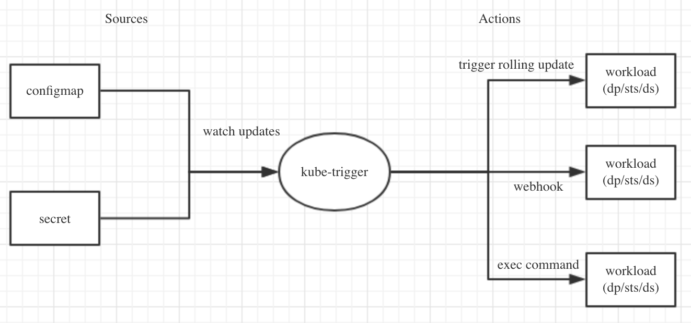

This is a POC project and not ready for production use !

## Introduction

kube-trigger is a controller running in cluster to watches source updates(ConfigMap,Secrets) and apply some actions.

kube-trigger use a CRD `TriggerRule` to define sources and actions.

Following `TriggerRule` defines that when configmap changes, trigger a rolling update for statefulset busybox.

```
apiVersion: app.example.com/v1alpha1
kind: TriggerRule
metadata:
  name: example
spec:
  actions:
  - updatePodTemplate:
      objectRef:
        kind: StatefulSet
        name: busybox
        namespace: kubetrigger-statefulset-1560220263
  sources:
  - objectRef:
      kind: ConfigMap
      name: cm
      namespace: kubetrigger-statefulset-1560220263
```

### Why kube-trigger?

Kubernetes has a [historical issue](https://github.com/kubernetes/kubernetes/issues/22368) that people wants to automatically rollout their configmaps. 

A common approach is to write your app to listening to a url or signal to reload itself. And use a [sidecar](https://github.com/jimmidyson/configmap-reload) watches config file changes and reload the app.

kube-trigger provide a alternative to do this without using sidecar. For apps that not support reload, kube-trigger can trigger rolling update.

More important, sources and actions in kube-trigger can be extended(eg. source can be a timer to restart pod periodly), which give a more custom ability to achieve your goals. 

### TODO List

- [x] support rolling update
- [ ] support webhook
- [ ] support exec
- [ ] CRD validations

## Design



## Development 

### Prerequisites

- golang environment(1.12, with go mudule enabled)
- docker (used for creating container images, etc.) 
- [kind](https://github.com/kubernetes-sigs/kind) or minikube (optional)

### Build Image 

```
operator-sdk build --verbose <ImageName>
docker push <ImageName>
```

### Testing 

#### Running end-to-end tests on local cluster:

```
operator-sdk test local ./test/e2e --verbose
```


